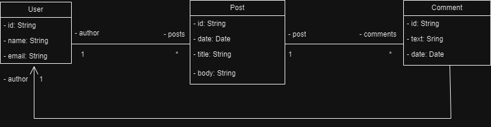
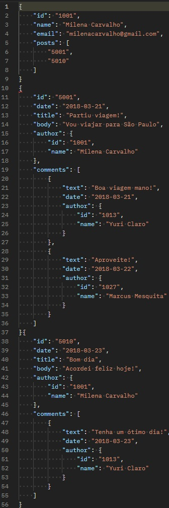

# Projeto de Posts com Usuarios e Comentários

# Sobre o Projeto
Este projeto é uma aplicação de MongoDB com Spring Boot, onde será realizado consultas com Spring Data e MongoRepository em Posts de Usuarios com Comentarios.

# Modelo Conceitual

# Tecnologias Utilizadas
- Java
- MongoDB
- SpringBoot
- NoSQL
- Diagramas UML

# Exemplo

